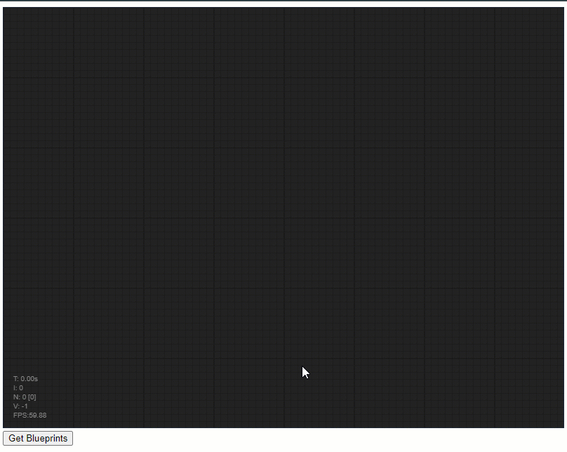

<p align="center">
  <picture>
    <source media="(prefers-color-scheme: dark)" srcset="./docs/images/logo-dark.svg">
    <source media="(prefers-color-scheme: light)" srcset="./docs/images/logo-light.svg">
    
  </picture>
</p>

## Cloud Vision Toolkit

The Vision Toolkit, developed by the AU / UK Vision team, is a graph flow-based editor that streamlines vision code development. Users can dynamically update code by dragging and connecting nodes, seeing changes in real time. Integrated with TwinCAT Native, it offers an intuitive, efficient toolset for rapid development and visualization, suitable for all skill levels.

The cloud vision toolkit is a project in two parts. The TwinCAT project is referred to as the backend, and the Web server + webpage is known as the frontend.

## Getting started

### Clone the repo

```
git clone https://github.com/VisionToolkit-Dev-Team/cloud-vision-toolkit
```

### TwinCAT (backend)

1. Check you have installed the following

   - TwinCAT XAE 4024.62 (minimum)
   - TwinCAT Vision 4.0.5.10 (minimum)

2. Open, activate and run the TwinCAT project `\src\twincat\cloud-vision-toolkit.sln`.

If you are missing any of the mobject-libraries, then simply right click on the project and select "Install Project Library (unknown versions)"

### Web Server (frontend)

By default you must run the frontend on the same IPC as the backend. You can change this by changing the netId in `src\node.js\config\config.js`, default '127.0.0.1.1.1'.

1. Open the command prompt at `\src\node.js\`.

2. Install node dependencies (required only once)

```
npm install
```

3. Run the UI

```
npm start
```

## Screenshot



If all is successful your browser will open and you can use the toolkit.
